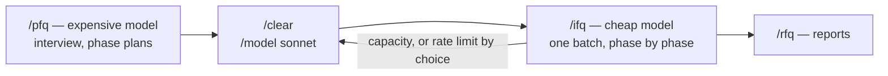
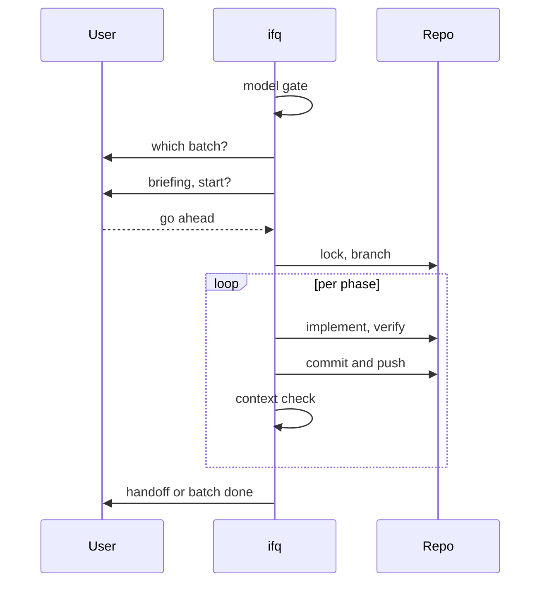
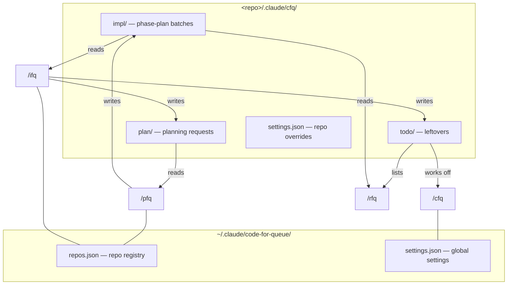
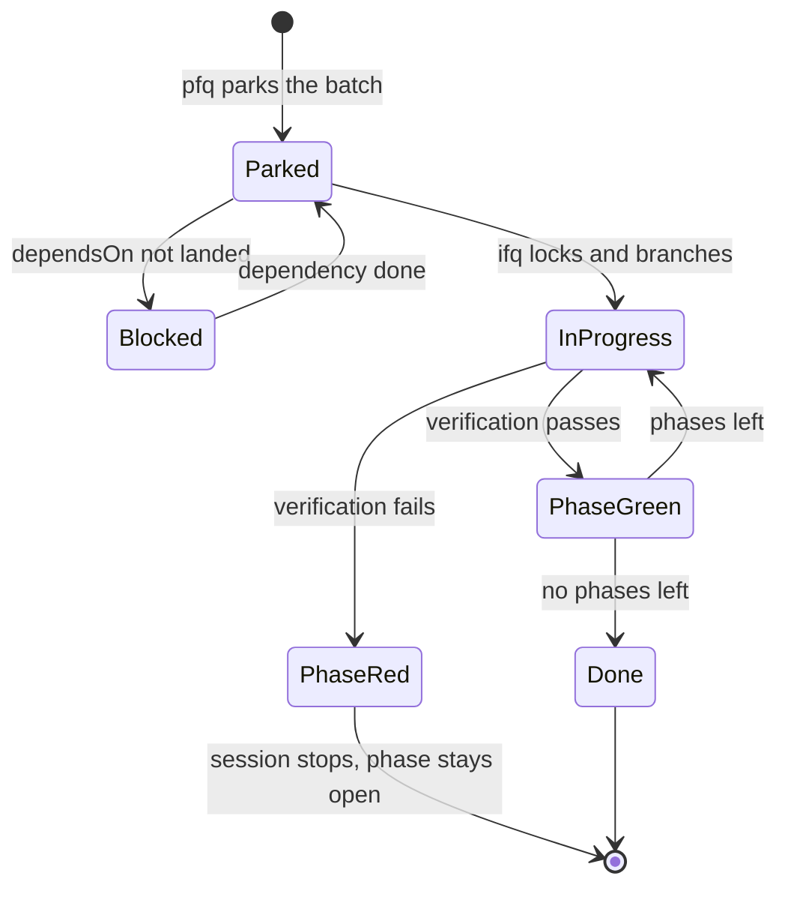

# code-for-queue (cfq)

Plan with an expensive model, implement with a cheap one. Phased plans park as numbered markdown
files in a repo-local queue and get worked off one batch per session, phase by phase. A dashboard
shows every queue across every repo at a glance.



## Guides

- [Setup](docs/setup.md) — install the plugin and run first-time setup
- [Usage](docs/usage.md) — what each skill does, step by step, with a "how do I…" for every
  common task
- [Configuration](docs/configuration.md) — every setting, how to view and change them globally
  or per repo

## Installation

```
/plugin marketplace add gumbaldi/magicbox
/plugin install cfq@magicbox
```

Then run `/cfq` once for first-time setup.

Upgrading from a `gumbaclaude` marketplace install: the GitHub repo was renamed from
`gumbaldi/gumbaclaude` to `gumbaldi/magicbox` (it now hosts skills for other AI providers too, not
just Claude Code plugins), and the marketplace name changed to match. Remove the old marketplace
entry and reinstall: `/plugin marketplace remove gumbaclaude`, then run the two commands above.
Settings and the repo registry live in `~/.claude/code-for-queue/` and are kept.

Upgrading from 0.1.x: the plugin itself was also renamed from `code-for-queue` to `cfq` so its skills
show up as `cfq:plan-for-queue`. Claude Code treats that as a different plugin, so remove the old one
once: `/plugin uninstall code-for-queue`, then install as above.

## The four commands

| Command | Long form | Purpose |
|---|---|---|
| `/pfq` | `/plan-for-queue` | Interviews you (quick, thorough grilling, or grilling with docs), resolves open questions, and parks phased plans as numbered files — it never edits code. |
| `/ifq` | `/implement-for-queue` | Works off one batch from the current repo's queue, phase by phase, committing and pushing every green phase. |
| `/cfq` | `/code-for-queue` | Handles first-time setup, the cross-repo dashboard, repo-local queue management, and settings. |
| `/rfq` | `/report-for-queue` | Shows implementation reports for finished batches, as a compact table or a detailed HTML report. |

## What each skill does

### `/pfq`

Asks for interview depth first (quick / thorough grilling / grilling with docs), reads the code,
clarifies open points, proposes a phase split, and parks numbered plan files. Never edits code.

### `/ifq`

Gates on the model, picks a batch, briefs it and waits for a go-ahead before touching anything,
takes a repo lock, creates the batch branch, works one phase at a time, commits and pushes every
green phase immediately, and hands the session off when the capacity threshold (`stopUsed`) fires —
a full context window genuinely can't continue. Crossing a rate-limit threshold (`stopFiveHourPct` /
`stopSevenDayPct`) or failing to read context usage at all only produces a `WARN`: the next phase
is offered with the warning attached, and the user decides whether to continue or hand off.

Never two batches in the same session, even if the first finishes early — different plans belong
in separate context windows. Only one `/ifq` session works a given repo at a time: a second one
aborts with the name of the holder, unless that session has been silent for `sessionStaleSeconds`
(default 1800s / 30 minutes, configurable), in which case it's considered dead and taken over.



#### Orchestrator mode

On by default (`orchestratorMode`). Instead of implementing every phase in the session itself,
`/ifq` spawns one worker sub-agent per phase — each with a fresh context window and a
deterministic briefing — and decides between phases whether the next one starts. The worker
implements, verifies and commits its own phase; the orchestrator only reads its returned report,
never its code. In practice this means no `/clear`-and-`/model sonnet` cycle between phases: the
same session keeps going, and each phase's worker runs visibly in the terminal. The session still
hands off when a rate-limit window is crossed, same as before — the capacity-based context gate
that stopped a classic session doesn't apply to a worker that starts fresh every phase.

Turn it off per repo (`bin/cfq settings set --repo <path> orchestratorMode false`), globally
(`bin/cfq settings set orchestratorMode false`), or for one shell (`CFQ_ORCHESTRATOR_MODE=0`) to
go back to implementing every phase in the session itself.

### `/cfq`

First-time setup, the cross-repo dashboard, management of the current repo's queue, and the
settings.

### `/rfq`

Read-only: the compact terminal table across all repos, and the detailed HTML report for a single
batch.

## The three queues

```
<repo>/.claude/cfq/
  settings.json          # repo-scoped setting overrides (trackable, versioned)
  impl/                  # phase-plan batches — ifq reads, pfq writes
    <NNN>-<YYYY-MM-DD>-<topic>/  # numbered batch identity, assigned at pfq park time
      01-first-phase.md
      02-second-phase.md
      .priority          # optional, contains "high"
      .dependsOn         # optional: one batch directory name per line
      report.json        # written by ifq, includes telemetry
      done/              # finished phases
    done/                # finished batches
  plan/                  # planning-request inbox — ifq writes, pfq reads
    <YYYY-MM-DD>-<slug>.md
    done/
  todo/                  # one-off follow-ups — ifq writes, cfq works off, rfq lists
    <YYYY-MM-DD>-<slug>.md
    done/
  telemetry.jsonl        # one record per planning session and per phase
  .lock                  # held by the running ifq session
  .maintenance           # marker for the periodic maintenance run
```

Everything under `.claude/cfq/` except `settings.json` is repo-local workflow state, not something
to publish — by default (`gitStatePolicy: local`) cfq keeps it out of Git via a managed block in
the clone's local `.git/info/exclude`, leaving `settings.json` trackable so a repo-wide override can
still be committed and shared. Set `gitStatePolicy: trackable` to remove cfq's managed block and let
normal repository `.gitignore`/tracking apply instead; cfq never edits `.gitignore` itself.

Upgrading from a pre-`.claude/cfq/` install: a repo still on the old repo-local
`.claude/code-for-queue/` layout is not migrated automatically. Run the isolated upgrade utility
once — `scripts/migrations/cfq-layout-v1.sh plan --all-known` to preview across every known repo,
then `apply --all-known` to perform it; nothing under the old root is discarded, and a genuine
conflict (a file that differs from its new-layout counterpart) blocks removal of the old root
instead of silently overwriting it.

- `impl/` — the phase-plan batches. `pfq` writes, `ifq` reads.
- `plan/` — the planning-request inbox. `ifq` drops follow-up work here that was out of scope for
  the phase it was working; `pfq` offers those as topics at the start of its next session.
- `todo/` — **one-off leftovers.** Everything a batch run leaves behind that still needs a manual
  look later: an unmerged branch, a language-drift finding, a check that could not be automated.
  `ifq` writes them, `/cfq` works them off for the current repo, `/rfq` lists them. An entry may
  carry a `check: <shell-command>` line — exit 0 means it is done.



`.dependsOn` blocks a batch for as long as any batch it names hasn't landed in `done/` yet; a
name that resolves to neither an open nor a finished batch is deliberately never blocking —
it's flagged in the dashboard instead.

## Command reference

`bin/cfq <noun> <verb> [args...]` is the one entrypoint every skill calls — no skill or reference
file ever mutates `.claude/cfq/` by hand (`rm`, `mv`, `mkdir`, `jq`, …), only through one of these.
Most of them run only from inside a skill; `dash`, `settings`, `doctor` and `security` are also
useful to run directly. `bin/cfq <noun> --help` prints a noun's own usage.

| Noun | Purpose |
|---|---|
| `batch` | Numbered batch identity: `allocate`/`reconcile` the ledger, `verify`/`recover` a batch's completion state, `ready` to clear `.planning`. |
| `branch` | Resolves and creates the per-batch branch (`plan`), checks a candidate name (`check`). |
| `brief` | Renders a batch or single-phase announcement from the phase files on disk. |
| `changelog` | Reads and writes `cfq.changelog.yml` (`init`, `commit-message`, status lookups). |
| `ctx` | Post-phase context/rate-limit gate — `OK`/`WARN`/`STOP`. |
| `dash` | Cross-repo dashboard: queues, phases, config. |
| `doctor` | Host dependency check (`bash`/`git`/`python3` required, `gh`/`tea`/`npm` optional). |
| `finish` | Moves a finished batch into `impl/done/` and runs the closing sequence. |
| `lang` | Scans for prose, comments and identifiers that don't match `codeLanguage`. |
| `layout` | Owns the `.claude/cfq/` layout, the git-exclude policy, and write-probe cleanup. |
| `lint` | Structural lint for a batch's phase plans (`## Size`, `## Affected Files`, …). |
| `lock` | The repo lock held by the currently running `/ifq` session. |
| `maintenance` | Whether the periodic maintenance run is due. |
| `note` | Writes a `plan/` or `todo/` queue entry — owns date, slug and target path. |
| `overlap` | Cross-batch `## Affected Files` overlap, for `/pfq`'s queue check. |
| `park` | Writes `.priority`/`.dependsOn`, the git-exclude entry; registers the repo. |
| `phase` | Records (or reopens) a phase — ledger entry and `done/` move as one transaction. |
| `preflight-impl` | `/ifq`'s one aggregator call: policy, batch selection, size gate. |
| `preflight-plan` | `/pfq`'s one aggregator call: policy, language, security capability, queue state. |
| `registry` | The cross-repo repo list in `~/.claude/code-for-queue/repos.json`. |
| `report` | The per-phase telemetry ledger (`report.json`) — `append`, `set-commit`, `skills`, `summary`. |
| `resume` | Done/open phases, last commit, deviations, red-phase history for a batch. |
| `runtime` | Session id, transcript path, model name, context usage — the one Claude-Code-specific adapter. |
| `scan` | Every registered/discovered repo's queues, counted live from disk. |
| `security` | Security snapshot — forge advisories (`gh`/`tea`) plus `npm audit`. |
| `settings` | The global/repo/env settings tiers. |
| `telemetry` | Turns, wallclock and tokens per planning session and per implemented phase. |
| `trash` | The only sanctioned delete under `.claude/cfq/` — moves to `.trash/<timestamp>/`, never erases. |

## Hook contract

`PreToolUse` on `Write`/`Edit` is the only hook class that can structurally break a `pfq` session.
It is the only class that can deny a tool call, and every file a `pfq` session produces is written
through that tool. A `PreToolUse` hook on `Bash` rewrites commands rather than denying them, and
`SessionStart` runs before the skill is loaded — neither can stop a park. The bundled `SessionStart`
hook itself (the host dependency check) now runs through `${CLAUDE_PLUGIN_ROOT}/bin/cfq doctor
hook` rather than calling `cfq_doctor.py` directly, same as every other cfq entrypoint.

A guard hook that restricts writes must let these paths through, or `pfq` dies mid-park with a
half-written batch in the queue:

- `<repo>/.claude/cfq/**` — the three queues, and the only path every `pfq` session writes.
  `bin/cfq layout` (implemented in `scripts/`) is the source of truth for this list; read it there
  rather than copying the entries into the hook by hand.
- `<repo>/CONTEXT.md` and `<repo>/docs/adr/**` — written only on the "Grilling with docs" interview
  path, and easy to miss because no other interview depth touches them.

Everything else `cfq` writes — the changelog, the registry, `report.json`, `.priority`,
`.dependsOn`, the global state store under `$HOME/.claude/code-for-queue/` — goes through cfq's own
scripts over `Bash` and is never seen by a `Write`/`Edit` hook.

Renaming the queue layout means updating every external guard hook too. That coupling is invisible
from inside this repository, which is how it broke once: a hook still allowed the pre-migration
`.claude/code-for-queue/` path long after the queues had moved to `.claude/cfq/`.

**The plugin ships its own `PreToolUse` guard** (`bin/cfq guard pretooluse`, wired in
`hooks/hooks.json`), separate from the external-hook concern above. It denies `Bash` commands
(`rm`, `mv`, `cp`, `truncate`, `shred`, `dd`, `ln`, `install`, `sed -i`, a `>`/`>>` redirect, or
`find … -delete`/`-exec rm`) whose resolved target has `.claude/cfq` as a path component, and
denies `Write`/`Edit` calls that target `impl/<batch>/done/**` or `impl/done/<batch>/**` directly.
It allows every read (`cat`, `ls`, `grep`, …) and every `bin/cfq` call, since those are exactly the
sanctioned commands the guard's own deny messages point to. Paths are resolved against the
payload's `cwd`, not matched as a literal string, so `cd <batch> && rm -rf done/` is caught the
same as a fully-qualified path. There is no setting to turn it off — disabling it means disabling
the plugin. It fails open on an internal error: a crash allows the call rather than blocking every
`Bash` call in the session.

## Batch lifecycle



A green phase means the plan file moved into the batch's `done/` and the commit is pushed; a
finished batch means the whole batch directory moved into `impl/done/`.

## Output

Progress is reported as status lines — one per step, printed as it happens:

```
PRECHECKS
✅ Model Gate       sonnet · implModels: sonnet
✅ Batch            2026-08-13-cfq-plugin · 1 open phase
➖ Failed Attempt   none
⚠️ Security Diff    unavailable for this repo

IMPLEMENTATION
✅ P6 livetest      green · 6 deviations
```

`✅` done · `⚠️` warning or unavailable · `❌` failed · `➖` skipped, with the reason in the
detail column.

## Reports

Every phase `ifq` finishes — green or red — is recorded to `<batch-dir>/report.json`: which
phases went green, which failed, where the implementation departed from the plan, what broke,
which verification ran, and the commit SHA. It lives in the batch directory, so it travels with
the batch into `done/` and is covered by the same `.git/info/exclude` entry as the rest of the
queue.

Run `/rfq` for a compact terminal table across all repos, or drill into a single batch for the
detailed HTML report. The HTML is regenerated fresh on every request and can be deleted freely —
`report.json` is the source of truth.

## Telemetry

Every planning session and every implemented phase gets one record: turns, wallclock, and tokens
by kind, broken down by model, reasoning effort, skill, plugin, tool, and the subagent share —
plus the skills the plan recommended for that phase.

What's deliberately **not** recorded: no prompt text, no responses, no tool arguments, no file
contents. Numbers, timestamps and names only.

It's stored in the batch (`report.json`) and repo-locally (`telemetry.jsonl`), both covered by
the same `.git/info/exclude` line as the rest of the queue — nothing is written globally.
Optionally, point `telemetrySyncRepo` at a dedicated telemetry git repo: cfq then appends the new
lines to `<repo-name>.jsonl` there, commits and pushes, at the end of every planning or
implementation session. Failures there are never fatal.

cfq only collects this data — it doesn't analyze it.

## Security

`pfq` checks in Step 12, `ifq` checks again at the end of the batch. The forge
is detected from the origin remote; both common CLIs are supported:

| Forge | CLI | Source |
|---|---|---|
| GitHub | `gh` | Dependabot advisories and code-scanning alerts — SARIF results from a Checkmarx or CodeQL action land there too, so cfq needs no scanner CLI of its own |
| Gitea / Forgejo | `tea` | the forge has no security-alerts API; `tea` only confirms login and reachability, and that's reported openly |
| any | — | `npm audit` whenever a `package.json` exists, always in addition |

The host is checked explicitly against the CLI's own login list, since `tea` otherwise silently
falls back to a mismatched login and queries the wrong instance. A missing CLI or login produces
a hint naming the exact fix (`gh auth login` or `tea login add --url <host>`), never a generic one.

Only `critical`/`high` findings **with** an available fix get planned as a phase — everything else
stays a warning line.

## Configuration

Precedence: **env var > repo `.claude/cfq/settings.json` > global `settings.json` > default**.
Change via `/cfq`, or `"${CLAUDE_PLUGIN_ROOT}/bin/cfq" settings set [--repo <path>] <key>
<value>`. The legacy per-repo mechanism — an `env` block in `<repo>/.claude/settings.json` — still
works and still sits at the top tier:

```json
{ "env": { "CFQ_CODE_LANGUAGE": "en", "CFQ_DOC_LANGUAGES": "de", "CFQ_DOC_LEVEL": "standard" } }
```

See [`docs/configuration.md`](docs/configuration.md) for the full settings reference, including
the language and documentation-level settings.

## Host dependencies

Required: `bash`, `git`, `python3` (3.8 or newer, runs the ported implementations). Installing the
plugin does not install any of these — it only adds the plugin's own files. `bin/cfq doctor check`
reports what's missing and, for a required gap, a platform-appropriate install hint; the bundled
`SessionStart` hook runs it automatically and stays completely silent on a healthy host, only
warning (user and Claude both) when a required command is absent. Optional, each degrading only the
one feature it powers rather than blocking the plugin: `gh` or `tea` for the security check
(whichever matches the repo's forge), `npm` for `npm audit` on repos with a `package.json`.

## Optional dependencies

- **`mattpocock-skills`** — powers `grillMode: classic`, the frontier-per-round interview mode, and
  the `mattpocock-skills:grilling` + `mattpocock-skills:domain-modeling` combination behind the
  "Grilling with docs" path. Install: `/plugin marketplace add anthropics/claude-plugins-official`,
  then `/plugin install mattpocock-skills@claude-plugins-official`.
- **`ponytail`** — powers two one-shot uses: the optional cleanup audit, one of several tasks in
  the periodic maintenance run (`maintenanceEvery`), and `/ifq`'s batch-end `ponytail-review` over
  the batch diff — neither is the maintenance run itself, and neither needs ponytail's persistent
  mode. cfq expects ponytail dormant (`defaultMode: off` in `~/.config/ponytail/config.json`)
  outside those two uses — its own default is `full`, which would otherwise load it into every
  `pfq`/`ifq` session. `/cfq` offers to set this on first-time setup; `bin/cfq doctor check` keeps
  advising it afterward if declined or if ponytail is installed later.
  Install: `/plugin marketplace add DietrichGebert/ponytail`, then
  `/plugin install ponytail@ponytail`.

Everything except classic grill mode and the two ponytail uses works fully without either plugin —
"Grilling with docs" falls back to the same techniques in prose when `mattpocock-skills` is missing.

## Credits

Adapted from Matt Pocock's skills (MIT) — <https://github.com/mattpocock/skills>. The design-tree /
frontier model comes from `grilling`, the glossary-and-ADR discipline from `domain-modeling`, and the
combination of the two from `grill-with-docs`. cfq's own additions are the batched-round format,
the select-box protocol, and the fallback that keeps all of it working without the plugin.

- Grilling: <https://aihero.dev/skills-grilling>
- Grill with docs: <https://aihero.dev/skills-grill-with-docs>
- Domain modeling: <https://aihero.dev/skills-domain-modeling>

MIT licensed.
