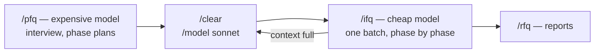
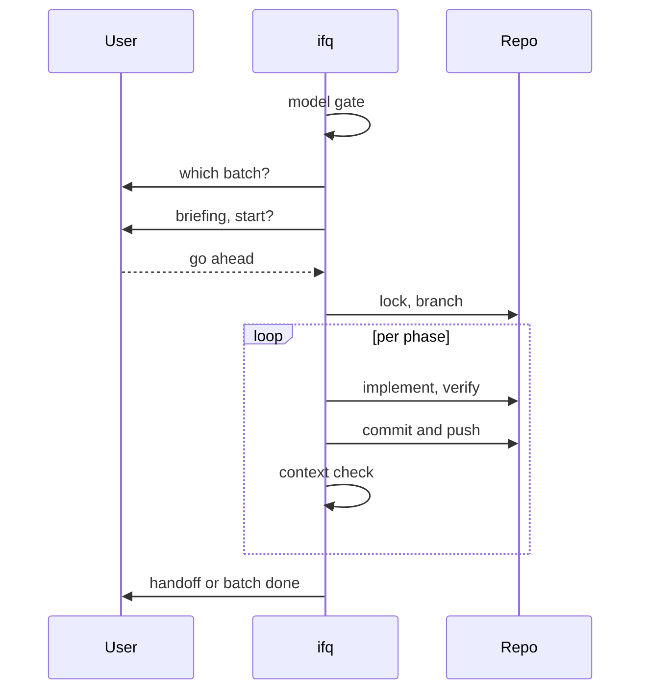
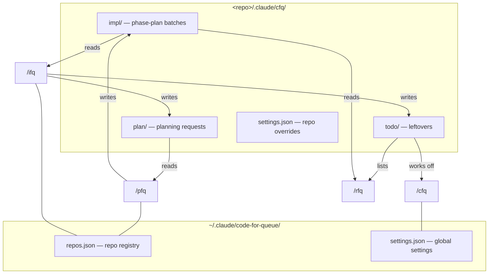
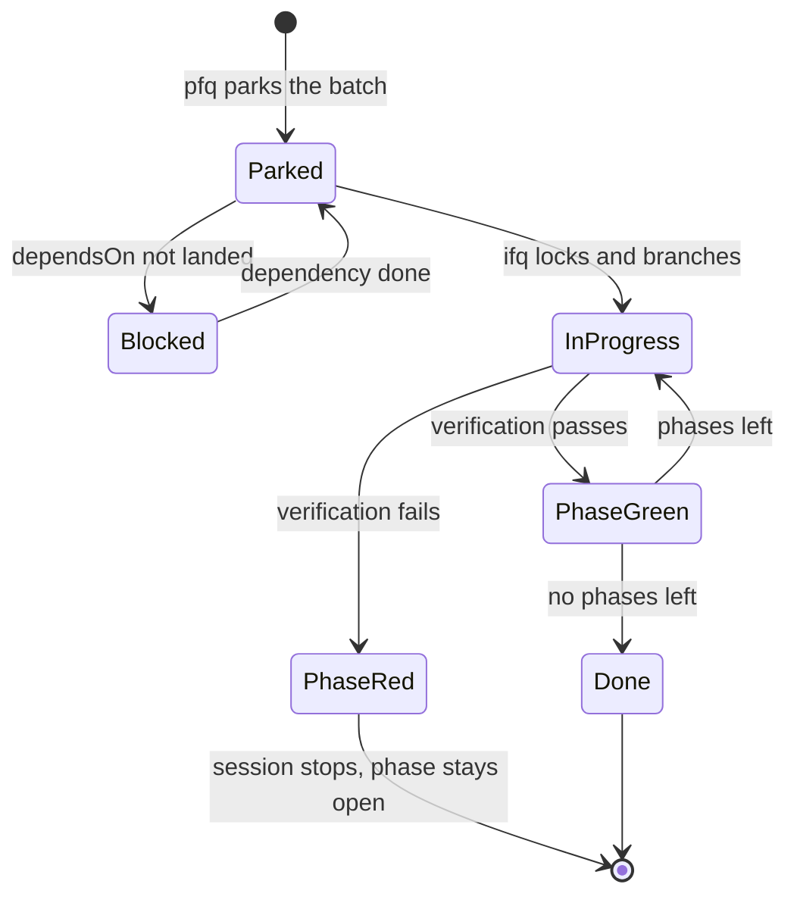

# code-for-queue (cfq)

Plan with an expensive model, implement with a cheap one. Phased plans park as numbered markdown
files in a repo-local queue and get worked off one batch per session, phase by phase. A dashboard
shows every queue across every repo at a glance.



## Guides

- [Setup](docs/setup.md) — install the plugin and run first-time setup
- [Usage](docs/usage.md) — what each skill does, step by step, with a "how do I…" for every
  common task
- [Configuration](docs/configuration.md) — every setting, how to view and change them globally
  or per repo

## Installation

```
/plugin marketplace add gumbaldi/magicbox
/plugin install cfq@magicbox
```

Then run `/cfq` once for first-time setup.

Upgrading from a `gumbaclaude` marketplace install: the GitHub repo was renamed from
`gumbaldi/gumbaclaude` to `gumbaldi/magicbox` (it now hosts skills for other AI providers too, not
just Claude Code plugins), and the marketplace name changed to match. Remove the old marketplace
entry and reinstall: `/plugin marketplace remove gumbaclaude`, then run the two commands above.
Settings and the repo registry live in `~/.claude/code-for-queue/` and are kept.

Upgrading from 0.1.x: the plugin itself was also renamed from `code-for-queue` to `cfq` so its skills
show up as `cfq:plan-for-queue`. Claude Code treats that as a different plugin, so remove the old one
once: `/plugin uninstall code-for-queue`, then install as above.

## The four commands

| Command | Long form | Purpose |
|---|---|---|
| `/pfq` | `/plan-for-queue` | Interviews you (quick, thorough grilling, or grilling with docs), resolves open questions, and parks phased plans as numbered files — it never edits code. |
| `/ifq` | `/implement-for-queue` | Works off one batch from the current repo's queue, phase by phase, committing and pushing every green phase. |
| `/cfq` | `/code-for-queue` | Handles first-time setup, the cross-repo dashboard, repo-local queue management, and settings. |
| `/rfq` | `/report-for-queue` | Shows implementation reports for finished batches, as a compact table or a detailed HTML report. |

## What each skill does

### `/pfq`

Asks for interview depth first (quick / thorough grilling / grilling with docs), reads the code,
clarifies open points, proposes a phase split, and parks numbered plan files. Never edits code.

### `/ifq`

Gates on the model, picks a batch, briefs it and waits for a go-ahead before touching anything,
takes a repo lock, creates the batch branch, works one phase at a time, commits and pushes every
green phase immediately, and hands the session off when the context window fills.

Never two batches in the same session, even if the first finishes early — different plans belong
in separate context windows. Only one `/ifq` session works a given repo at a time: a second one
aborts with the name of the holder, unless that session has been silent for `sessionStaleSeconds`
(default 1800s / 30 minutes, configurable), in which case it's considered dead and taken over.



### `/cfq`

First-time setup, the cross-repo dashboard, management of the current repo's queue, and the
settings.

### `/rfq`

Read-only: the compact terminal table across all repos, and the detailed HTML report for a single
batch.

## The three queues

```
<repo>/.claude/cfq/
  settings.json          # repo-scoped setting overrides (trackable, versioned)
  impl/                  # phase-plan batches — ifq reads, pfq writes
    <NNN>-<YYYY-MM-DD>-<topic>/  # numbered batch identity, assigned at pfq park time
      01-first-phase.md
      02-second-phase.md
      .priority          # optional, contains "high"
      .dependsOn         # optional: one batch directory name per line
      report.json        # written by ifq, includes telemetry
      done/              # finished phases
    done/                # finished batches
  plan/                  # planning-request inbox — ifq writes, pfq reads
    <YYYY-MM-DD>-<slug>.md
    done/
  todo/                  # one-off follow-ups — ifq writes, cfq works off, rfq lists
    <YYYY-MM-DD>-<slug>.md
    done/
  telemetry.jsonl        # one record per planning session and per phase
  .lock                  # held by the running ifq session
  .maintenance           # marker for the periodic maintenance run
```

Everything under `.claude/cfq/` except `settings.json` is repo-local workflow state, not something
to publish — by default (`gitStatePolicy: local`) cfq keeps it out of Git via a managed block in
the clone's local `.git/info/exclude`, leaving `settings.json` trackable so a repo-wide override can
still be committed and shared. Set `gitStatePolicy: trackable` to remove cfq's managed block and let
normal repository `.gitignore`/tracking apply instead; cfq never edits `.gitignore` itself.

Upgrading from a pre-`.claude/cfq/` install: a repo still on the old repo-local
`.claude/code-for-queue/` layout is not migrated automatically. Run the isolated upgrade utility
once — `scripts/migrations/cfq-layout-v1.sh plan --all-known` to preview across every known repo,
then `apply --all-known` to perform it; nothing under the old root is discarded, and a genuine
conflict (a file that differs from its new-layout counterpart) blocks removal of the old root
instead of silently overwriting it.

- `impl/` — the phase-plan batches. `pfq` writes, `ifq` reads.
- `plan/` — the planning-request inbox. `ifq` drops follow-up work here that was out of scope for
  the phase it was working; `pfq` offers those as topics at the start of its next session.
- `todo/` — **one-off leftovers.** Everything a batch run leaves behind that still needs a manual
  look later: an unmerged branch, a language-drift finding, a check that could not be automated.
  `ifq` writes them, `/cfq` works them off for the current repo, `/rfq` lists them. An entry may
  carry a `check: <shell-command>` line — exit 0 means it is done.



`.dependsOn` blocks a batch for as long as any batch it names hasn't landed in `done/` yet; a
name that resolves to neither an open nor a finished batch is deliberately never blocking —
it's flagged in the dashboard instead.

## Batch lifecycle



A green phase means the plan file moved into the batch's `done/` and the commit is pushed; a
finished batch means the whole batch directory moved into `impl/done/`.

## Output

Progress is reported as status lines — one per step, printed as it happens:

```
PRECHECKS
✅ Model Gate       sonnet · implModels: sonnet
✅ Batch            2026-08-13-cfq-plugin · 1 open phase
➖ Failed Attempt   none
⚠️ Security Diff    unavailable for this repo

IMPLEMENTATION
✅ P6 livetest      green · 6 deviations
```

`✅` done · `⚠️` warning or unavailable · `❌` failed · `➖` skipped, with the reason in the
detail column.

## Reports

Every phase `ifq` finishes — green or red — is recorded to `<batch-dir>/report.json`: which
phases went green, which failed, where the implementation departed from the plan, what broke,
which verification ran, and the commit SHA. It lives in the batch directory, so it travels with
the batch into `done/` and is covered by the same `.git/info/exclude` entry as the rest of the
queue.

Run `/rfq` for a compact terminal table across all repos, or drill into a single batch for the
detailed HTML report. The HTML is regenerated fresh on every request and can be deleted freely —
`report.json` is the source of truth.

## Telemetry

Every planning session and every implemented phase gets one record: turns, wallclock, and tokens
by kind, broken down by model, reasoning effort, skill, plugin, tool, and the subagent share —
plus the skills the plan recommended for that phase.

What's deliberately **not** recorded: no prompt text, no responses, no tool arguments, no file
contents. Numbers, timestamps and names only.

It's stored in the batch (`report.json`) and repo-locally (`telemetry.jsonl`), both covered by
the same `.git/info/exclude` line as the rest of the queue — nothing is written globally.
Optionally, point `telemetrySyncRepo` at a dedicated telemetry git repo: cfq then appends the new
lines to `<repo-name>.jsonl` there, commits and pushes, at the end of every planning or
implementation session. Failures there are never fatal.

cfq only collects this data — it doesn't analyze it.

## Security

`pfq` checks in Step 8, `ifq` checks again at the end of the batch. The forge
is detected from the origin remote; both common CLIs are supported:

| Forge | CLI | Source |
|---|---|---|
| GitHub | `gh` | Dependabot advisories and code-scanning alerts — SARIF results from a Checkmarx or CodeQL action land there too, so cfq needs no scanner CLI of its own |
| Gitea / Forgejo | `tea` | the forge has no security-alerts API; `tea` only confirms login and reachability, and that's reported openly |
| any | — | `npm audit` whenever a `package.json` exists, always in addition |

The host is checked explicitly against the CLI's own login list, since `tea` otherwise silently
falls back to a mismatched login and queries the wrong instance. A missing CLI or login produces
a hint naming the exact fix (`gh auth login` or `tea login add --url <host>`), never a generic one.

Only `critical`/`high` findings **with** an available fix get planned as a phase — everything else
stays a warning line.

## Configuration

Precedence: **env var > repo `.claude/cfq/settings.json` > global `settings.json` > default**.
Change via `/cfq`, or `"${CLAUDE_PLUGIN_ROOT}/scripts/cfq-settings.sh" set [--repo <path>] <key>
<value>`. The legacy per-repo mechanism — an `env` block in `<repo>/.claude/settings.json` — still
works and still sits at the top tier:

```json
{ "env": { "CFQ_CODE_LANGUAGE": "en", "CFQ_DOC_LANGUAGES": "de", "CFQ_DOC_LEVEL": "standard" } }
```

See [`docs/configuration.md`](docs/configuration.md) for the full settings reference, including
the language and documentation-level settings.

## Host dependencies

Required: `bash`, `git`, `jq`. Installing the plugin does not install any of these — it only adds
the plugin's own files. `cfq-doctor.sh check` reports what's missing and, for a required gap, a
platform-appropriate install hint; the bundled `SessionStart` hook runs it automatically and stays
completely silent on a healthy host, only warning (user and Claude both) when a required command is
absent. Optional, each degrading only the one feature it powers rather than blocking the plugin:
`gh` or `tea` for the security check (whichever matches the repo's forge), `npm` for `npm audit` on
repos with a `package.json`, `timeout`/`gtimeout` to bound the security check's network calls.

## Optional dependencies

- **`mattpocock-skills`** — powers `grillMode: classic`, the frontier-per-round interview mode, and
  the `mattpocock-skills:grilling` + `mattpocock-skills:domain-modeling` combination behind the
  "Grilling with docs" path. Install: `/plugin marketplace add anthropics/claude-plugins-official`,
  then `/plugin install mattpocock-skills@claude-plugins-official`.
- **`ponytail`** — powers the optional cleanup audit, one of several tasks in the periodic
  maintenance run (`maintenanceEvery`), not the maintenance run itself.
  Install: `/plugin marketplace add DietrichGebert/ponytail`, then
  `/plugin install ponytail@ponytail`.

Everything except classic grill mode and the cleanup audit works fully without either plugin —
"Grilling with docs" falls back to the same techniques in prose when `mattpocock-skills` is missing.

## Credits

Adapted from Matt Pocock's skills (MIT) — <https://github.com/mattpocock/skills>. The design-tree /
frontier model comes from `grilling`, the glossary-and-ADR discipline from `domain-modeling`, and the
combination of the two from `grill-with-docs`. cfq's own additions are the batched-round format,
the select-box protocol, and the fallback that keeps all of it working without the plugin.

- Grilling: <https://aihero.dev/skills-grilling>
- Grill with docs: <https://aihero.dev/skills-grill-with-docs>
- Domain modeling: <https://aihero.dev/skills-domain-modeling>

MIT licensed.
